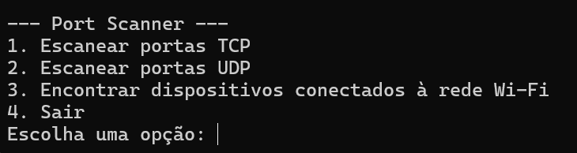

# Portscanner CLI
Esse repositório contém o arquivo .py que deverá ser rodado para accessar o programa. 
## Instalando
Para fazer a instalação de todas as dependências, será necessário abrir a raiz desse diretório e digitar o seguinte comando:
```
pip install -r requirements.txt
```

Depois disso, no mesmo diretório, rodar o comando: 
```
python portscanner.py
```
## Modo de uso
Ao rodar o comando anterior, a seguinte tela deve aparecer no seu terminal:



A partir dessas opções, você pode navegar pela aplicação explorando as possibilidades. O aplicativo permite escaneamento TCP e UDP a partir de um ip do Host e escaneamento da rede Wi-Fi via protocolo ARP.
Dentro das duas primeiras opções, é possível definir intervalo de portas a ser escaneado, incluindo uma opção de escaneamento de Well-Known ports.
Além disso, a resposta recebida da aplicação permite classificar as portas como Aberta, Fechada ou Filtrada. A aplicação também tem suporte para receber os endereços IP no padrão IPv6.
